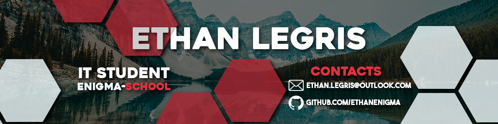

 

# 🚀 About Me :

👋 Hello, I'm Ethan Legris. 
🎓 I'm currently a 2nd year computer science student in Enigma School, France. 
💻 Interested in backend & frontend development (with stronger interest in backend), system administration and networking. 
🧐 Always curious about new technologies.

🔰Current Project : [Click here](https://github.com/EthanEnigma/TacosyMas)

 
 

# 🔧 Tech Stack

 

<picture>
    <source media="(prefers-color-scheme: dark)" srcset="https://raw.githubusercontent.com/EthanEnigma/EthanEnigma/output/pacman-contribution-graph-dark.svg">
    <source media="(prefers-color-scheme: light)" srcset="https://raw.githubusercontent.com/EthanEnigma/EthanEnigma/output/pacman-contribution-graph.svg">
    
</picture>

 

# 📬 Contact

📩Email : ethan.legris@outlook.com